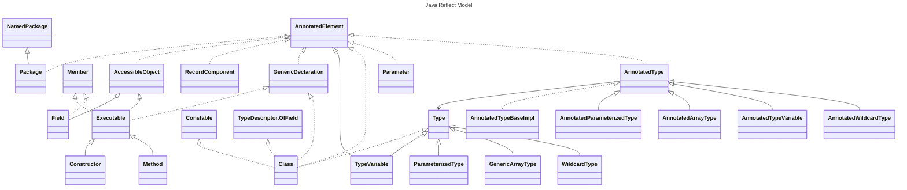
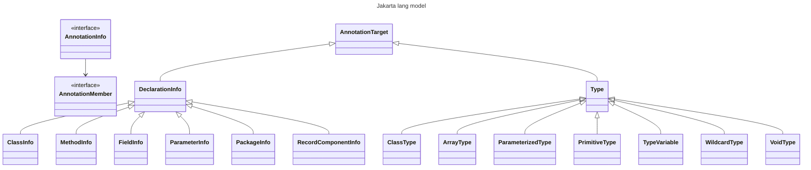

# Language Model

```mermaid
---
title: Java Reflect Model
---
classDiagram
    NamedPackage<|-- Package
    AnnotatedElement <|.. Package
    Member <|.. Executable
    Member <|.. Field
    
    AnnotatedElement <|.. AccessibleObject 
    AnnotatedElement <|.. RecordComponent

    AnnotatedElement <|.. GenericDeclaration
    AnnotatedElement <|-- TypeVariable
   

    Constable <|.. Class
    `TypeDescriptor.OfField` <|.. Class

    AnnotatedElement <|.. Class
    
    GenericDeclaration <|.. Executable
    GenericDeclaration <|.. Class
    
    AccessibleObject <|-- Field

    AccessibleObject <|-- Executable
    Executable <|-- Constructor
    Executable <|-- Method

    AnnotatedElement <|.. Parameter
    AnnotatedElement <|.. AnnotatedType

    AnnotatedType --> Type
    AnnotatedType <|.. AnnotatedTypeBaseImpl
    AnnotatedType <|-- AnnotatedParameterizedType
    AnnotatedType <|-- AnnotatedArrayType
    AnnotatedType <|-- AnnotatedTypeVariable
    AnnotatedType <|-- AnnotatedWildcardType
    
    Type <|.. Class
    Type <|-- TypeVariable
    Type <|-- ParameterizedType
    Type <|-- GenericArrayType
    Type <|-- WildcardType
```

```mermaid
---
title: Jakarta lang model 
---
classDiagram
class AnnotationMember
    <<interface>> AnnotationMember
    class AnnotationInfo
    <<interface>> AnnotationInfo
    
    AnnotationInfo --> AnnotationMember

    AnnotationTarget <|-- DeclarationInfo
    AnnotationTarget <|-- Type 

    Type <|-- ClassType
    Type <|-- ArrayType
    Type <|-- ParameterizedType
    Type <|-- PrimitiveType
    Type <|-- TypeVariable
    Type <|-- WildcardType
    Type <|-- VoidType
    
    DeclarationInfo <|-- ClassInfo
    DeclarationInfo <|-- MethodInfo
    DeclarationInfo <|-- FieldInfo
    DeclarationInfo <|-- ParameterInfo
    DeclarationInfo <|-- PackageInfo
    DeclarationInfo <|-- RecordComponentInfo

    
```
